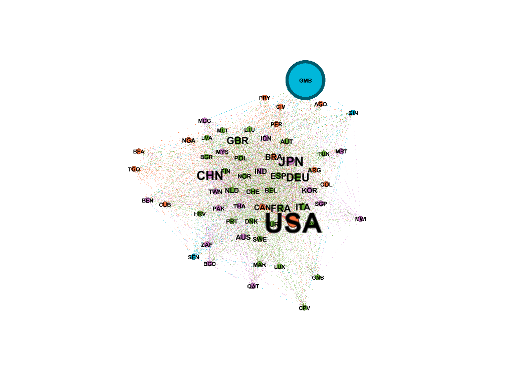
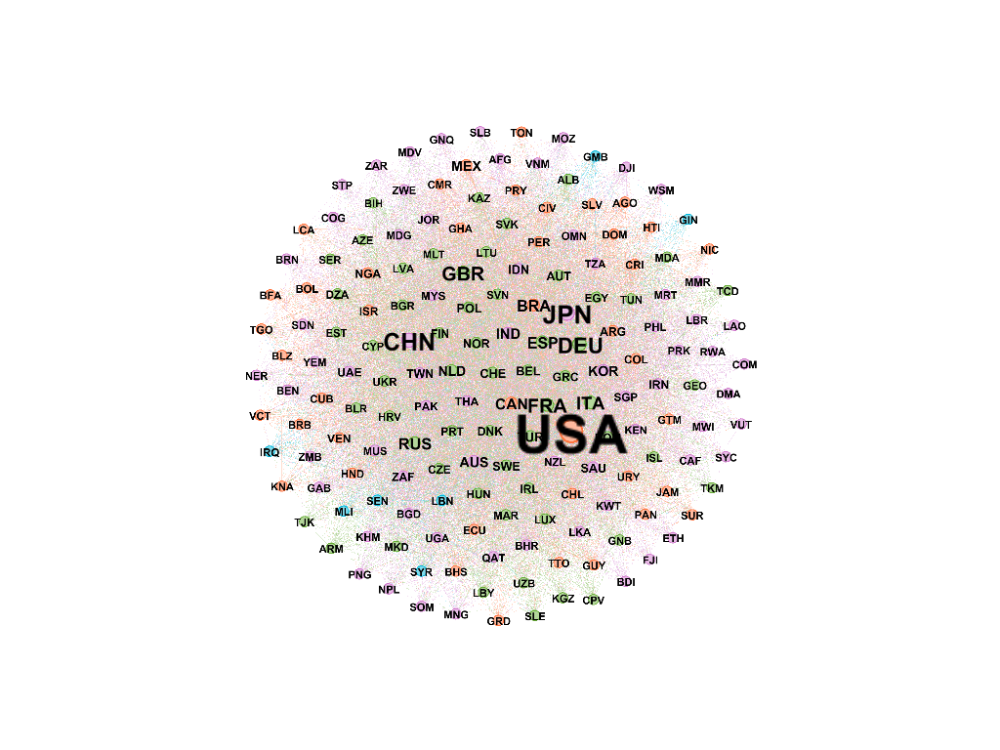
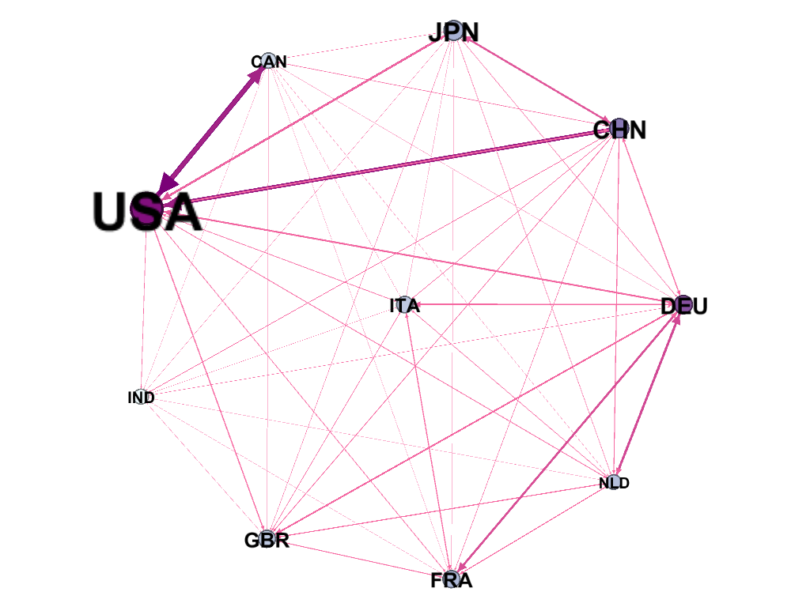
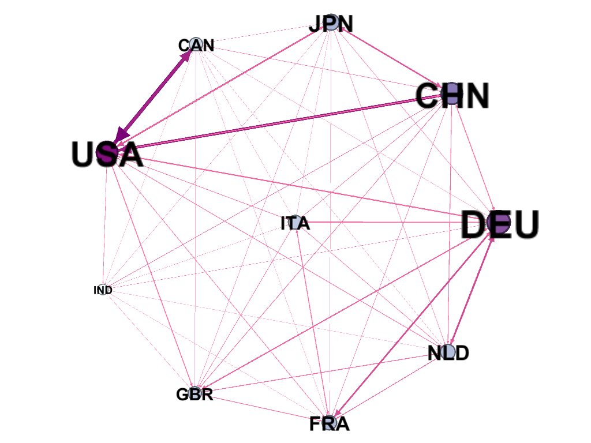
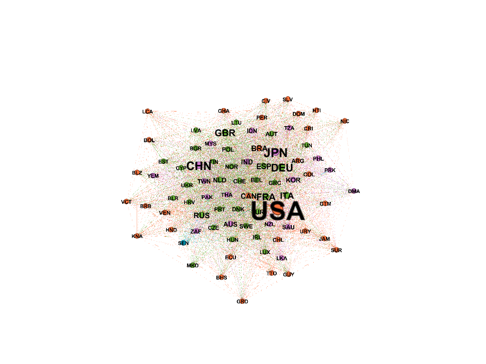
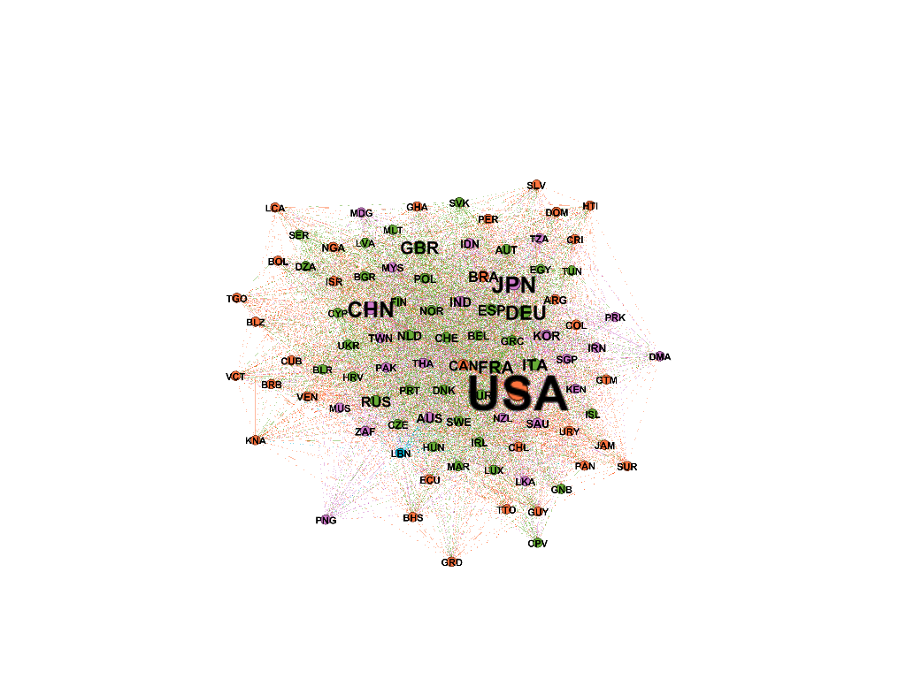
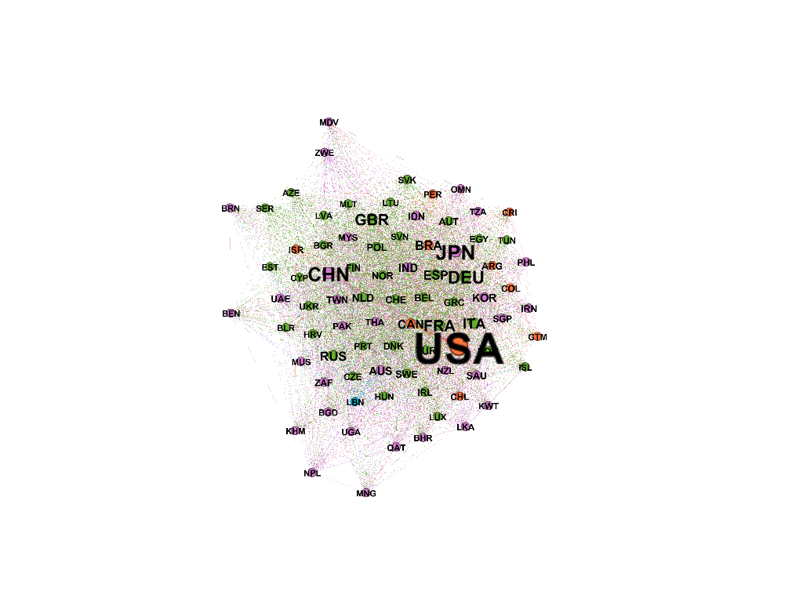

My whole idea: 
1. Find the ideas, what i want to do
2. Combine all of others works and Practise
[help r community detection](http://igraph.wikidot.com/community-detection-in-r)
3. Beautify and tell a story.

# Find my ideas
[doudin oil trade](http://www.docin.com/p-1051196927.html),
[struture holes](http://blog.sina.com.cn/s/blog_4a238ec20101schp.html)
[games of throne](https://blog.csdn.net/enweitech/article/details/77720426),
[global model](https://www.cambridge.org/core/services/aop-cambridge-core/content/view/A452C408399F331A19B59B2D7D8FA031/S2050124213000015a.pdf/gravitys_rainbow_a_dynamic_latent_space_model_for_the_world_trade_network.pdf)

1. the individual attributes
  - degrees and degree weights, set it as an attribute: try to find the main roles.
  - import/export: try to find countries role in the world.
  - centrialities: degree, closeness and betweeness: try to find the main roles. given a graph. Is there any country with a high value of one centriablity but a low one of another? Try to distinguish them.
  - relations with gdp.

2. bi-relations, like the positional dominance: positional dominance
3. the whole network structures

  - components analysis
  - clusters: wlktrap cluster: (games of throne)
  - a small-world? 
     - the network density,
     - the average trade path
     - the clustering coefficient?
  - core-periphy network
  
4. some assumptions:
  if we remove some special roles, what will happen? like the main role? the links?


what i need to do now:
- find the clustering methods, 
- realize one by one.
- find the story about the small world.
- find the story about core-periphy network
- beautify the results

# Beautify
[zhihu](https://www.zhihu.com/question/27813239),
[igraph tutorial](http://kateto.net/networks-r-igraph),
[a graph tool](https://gephi.org/),
[bar plot](https://blog.csdn.net/Bone_ACE/article/details/47455363),
[bar plot 2 multi](https://blog.csdn.net/nikang3148/article/details/83004399),
[bar plot horizontal](https://www.colabug.com/74610.html),
[point plot](http://blog.sina.com.cn/s/blog_12d5e3d3c0102x46l.html),
[zhihu ggplot](https://zhuanlan.zhihu.com/p/27093478),
[geom type](https://www.cnblogs.com/longzhongren/p/4310210.html)

refer to the one trade one road network fig3.

# Prepare the study object
```{r message=FALSE}
rm(list = ls())
setwd("E:/courses/Network analysis/lab/lab5")
library(igraph)
library(ggplot2)
library(ggraph)
library(ggthemes) # To plot figures
library(reshape2)
library(Rmisc) # To plot figures
library(grid) # To plot figures
library(maps) # To plot figures
library(ggmap) # To plot figure
set.seed(1996)

# Import data
countries <- read.csv("./data/countries.csv", header = T, sep=",", stringsAsFactors = F)
exports <- data.matrix(read.csv("./data/exports.csv", row.names = 1,
                                header = T, sep=",", stringsAsFactors = F))

# Rename and dealing with NA.
colnames(exports) <- countries$iso
rownames(exports) <- countries$iso
exports[is.na(exports)] <- 0
```
```{r}
# Build the graph and set vertex attributes.
trade_graph <- graph.adjacency(exports,mode = 'directed',weighted = T)
trade_graph <-set_vertex_attr(trade_graph,  "iso", index=countries$X, value=countries$iso)
trade_graph <-set_vertex_attr(trade_graph,  "gdp", index=countries$X, value=countries$gdp)
summary(trade_graph)
```

This is a directed graph with 174 nodes and 18416 edges. The density of the network is `r 18416/(174*173)`.

# Individual features.
## Centralities
```{r message=FALSE}
# degree centrialities
out_degree <- degree(trade_graph, mode = 'out')
in_degree <- degree(trade_graph, mode = 'in')
total_degree <- degree(trade_graph, mode = 'total')

trade_graph <-set_vertex_attr(trade_graph,  "OutDeg", index=countries$X, value=out_degree)
trade_graph <-set_vertex_attr(trade_graph,  "InDeg", index=countries$X, value=in_degree)

out_degree_g<- ggplot(data.frame(out_degree), aes(x=out_degree)) +
  xlim(0,175)+
  geom_density(fill = "lightblue", colour = "lightblue")
in_degree_g<- ggplot(data.frame(in_degree), aes(x=in_degree)) +
  xlim(0,175)+
  geom_density(fill = "lightblue", colour = "lightblue")
tot_degree_g<- ggplot(data.frame(total_degree), aes(x=total_degree)) +
  xlim(0,350)+
  geom_density(fill = "lightblue", colour = "lightblue")
 
grid.newpage()
pushViewport(viewport(layout = grid.layout(2, 2)))
vplayout = function(x, y) viewport(layout.pos.row = x, layout.pos.col = y)
print(out_degree_g, vp = vplayout(1, 1))
print(in_degree_g, vp = vplayout(1, 2))
print(tot_degree_g, vp = vplayout(2, 1:2))
```

From the density of degree distribution, we see that the out-degree distributions are much uniform than in-degree and total-degree. In in-degree distribution, more countries' import from around the average number of countries. There isn't an obvious tendency in total-degree distribution. The interactions of a country with other countries change a lot among different countries.

```{r message=FALSE}
deg_data=data.frame(t(rbind(countries$iso,out_degree, in_degree)))
deg_data<-melt(deg_data, id.vars = "V1", variable.name = "Type", value.name = "Deg")

samples<-sample(1:174,10)
samples<-c(samples,174+samples)

ggplot(deg_data[samples,], aes(V1,Deg,fill=Type))+
  geom_bar(stat="identity",position="dodge")+
  ggtitle("The Out-degree and In-degree of countries")+
  theme_economist(base_size=10)+
  scale_fill_economist()+
  theme(axis.ticks.length=unit(0.3,'cm'))+
  guides(fill=guide_legend(title=NULL))+
  coord_flip()

```

We randomly select 10 countries to see their out-degrees and in-degrees. From this figure, we see these two degrees are almost at the same level for a certain country, (e.g. the numbers are similar) with a little difference. In another word, if a country has a large out degree, its in degree is also very likely to be large.


Then, we try to explore on the nodes' strength. That is, the weighted node degrees. Here we define three kinds of node's strength by import, export and total trade, $s_{im}(i)=\Sigma_{j\in N}w_{ij}$, $s_{ex}(i)=\Sigma_{j\in N}w_{ji}$ and $s_{tot}(i)=\Sigma_{j\in N}(w_{ij}+w_{ji})$. $w_{ij}$ is the item's value in exports.csv file.

```{r message=FALSE}
# weighted node strength
total_export <- c(0, times=174)
total_import <- c(0, times=174)

for(i in c(1:174)){
  total_import[i] <- sum(exports[i,])
  total_export[i] <- sum(exports[,i])
}
total_trade<-total_export+total_import

trade_graph <-set_vertex_attr(trade_graph,  "Export", index=countries$X, value=total_export)
trade_graph <-set_vertex_attr(trade_graph,  "Import", index=countries$X, value=total_import)
trade_graph <-set_vertex_attr(trade_graph,  "TotTrade", index=countries$X, value=total_trade)

# Add new attribute, splitting countries upon their amount of import and export
countries$type[which(total_export >= total_import)] <- 1
countries$type[which(total_export < total_import)] <- 2
trade_graph <-set_vertex_attr(trade_graph,  "TradeType", index=countries$X, value=countries$type)

import_g <- ggplot(data.frame(log(total_import)),aes(x=log(total_import))) +
  xlim(0,15)+
  geom_density(fill = "lightblue", colour = "lightblue")
export_g <- ggplot(data.frame(log(total_export)),aes(x=log(total_export))) +
  xlim(0,15)+
  geom_density(fill = "lightblue", colour = "lightblue")
total_trade_g <- ggplot(data.frame(log(total_trade)),aes(x=log(total_trade))) +
  xlim(0,30)+
  geom_density(fill = "lightblue", colour = "lightblue")

grid.newpage()
pushViewport(viewport(layout = grid.layout(2, 2)))
print(import_g, vp = vplayout(1, 1))
print(export_g, vp = vplayout(1, 2))
print(total_trade_g, vp = vplayout(2, 1:2))
```
TODO: find the relations of GDP and total trade.

Since the range of import(export) amount is very large, we see its log-density. All of the three (total import, total export and total trade) graphs look like a normal distribution. That means more countries have small export(import, total trade) amout, while few countries have pretty large amount of export(import. total trade). 

Like what we do in the degree analysis, we also randomly choose 10 samples to analyse their trade amount distribution.


```{r message=FALSE}
trade_data=data.frame(t(rbind(countries$iso,total_export, total_import)))
trade_data<-melt(trade_data, id.vars = "V1", variable.name = "Type", value.name = "Trade")

samples<-sample(1:174,10)
samples<-c(samples,174+samples)

ggplot(trade_data[samples,], aes(V1,Trade,fill=Type))+
  geom_bar(stat="identity",position="dodge")+
  ggtitle("The Export and Import of countries")+
  theme_economist(base_size=10)+
  scale_fill_economist()+
  xlab("Countries' ISOs")+
  theme(axis.ticks.length=unit(0.3,'cm'))+
  guides(fill=guide_legend(title=NULL))+
  coord_flip()
```
TODO: make a pie chart of GDP and total trade


Different from the degree graph, it is worth noticing that some countries have big difference between import and export amount (e.g. in our 10 samples, STP's export amount is more than 2 times of its import amount; GHA's import amount is more than 10 times of its export amount). We believe it is not a random phenomenan and try to explore the relation of degree and weighted degree.

```{r message=FALSE}
relation_data<-data.frame(cbind(total_trade, total_degree))
colnames(relation_data)<-c("Trade","Degree")
relation_data_log<-data.frame(cbind(total_trade, log(total_degree)))
colnames(relation_data_log)<-c("Trade","LogDegree")
td_graph<-ggplot(relation_data, aes(x=Degree, y=Trade))+geom_point()
td_log_graph<-ggplot(relation_data_log, aes(x=LogDegree, y=Trade))+geom_point()

grid.newpage()
pushViewport(viewport(layout = grid.layout(1, 2)))
print(td_graph, vp = vplayout(1, 1))
print(td_log_graph, vp = vplayout(1, 2))

```
The left figure describes the relation of degree and trade amout. The right figure describes the relation of the log of degree and trade amount. Their shapes are similar, which means that the huge amount of trades tightly happen on countries with large degrees.

In the following part, we calculate three centrialities, betweeness centriality, degree centrialities and closeness centrialities for each country and make some comparisons to figure out sepcial countries' roles.

- Betweeness Centriality: $c_B(i)=\Sigma_{s,t\in N}\frac{\sigma(s,t|i)}{\sigma(s,t)}$, describes a node's role as an information medium. It calculated the times of a node in the shorteset paths between two other nodes. In some way, a node with high betweeness centriality controls the information broadcast among clusters. If a node connecting two seperate clusters, it can have a high betweeness centrialities even with low degree centrialities.
- Degree Centriality: $c_D(i)=\frac{\Sigma_j (x_{ij}+x_{ji})}{2(N-1)}$. It describes the number of neighbours of a node, directly reflecting a node's active level.
- Closeness Centriality: $c_C(i)=\frac{R(i)}{N-1}\cdot[\frac{\Sigma_{t\in i\to* t}dist(i,t)}{R(i)}]^{-1}$. It evaluates the average shortest path of a node to the others.

```{r message=FALSE}
# Degree Centrialities
bet_cent<-centr_betw(trade_graph)
clo_cent<-centr_clo(trade_graph)
deg_cent<-centr_degree(trade_graph)

trade_graph <-set_vertex_attr(trade_graph,  "BetCent", index=countries$X, value=bet_cent)
trade_graph <-set_vertex_attr(trade_graph,  "CloCent", index=countries$X, value=clo_cent)
trade_graph <-set_vertex_attr(trade_graph,  "DegCent", index=countries$X, value=deg_cent)

# Select the top10 countries based on gdp and make the figures to see their standarized centrialities.
top10_gdp<-order(countries$gdp, decreasing = TRUE)[1:10]
top10_gdp_bet<-bet_cent[[1]][top10_gdp]
top10_gdp_clo<-clo_cent[[1]][top10_gdp]
top10_gdp_deg<-deg_cent[[1]][top10_gdp]

cent_data=data.frame(t(rbind(countries$iso[top10_gdp],top10_gdp_bet/max(bet_cent[[1]]),
                             top10_gdp_clo/max(clo_cent[[1]]),top10_gdp_deg/max(deg_cent[[1]]))))
colnames(cent_data)<-c("ISO","BET","CLO","DEG")
cent_data<-melt(cent_data, id.vars = "ISO", variable.name = "Type", value.name = "Centriality")

ggplot(cent_data, aes(factor(ISO,levels = countries$iso[top10_gdp]),as.numeric(Centriality),fill=Type))+
  geom_bar(stat="identity",position="stack")+
  ggtitle("The Three Centrialities of Top GDP countries")+
  theme_economist(base_size=10)+
  scale_fill_economist()+
  xlab("Countries' ISOs")+
  ylab("Three Centrialities")+
  guides(fill=guide_legend(title=NULL))+
  theme(axis.ticks.length=unit(0.6,'cm'))+
  coord_flip()
```
We select 10 countries with top10 GDP and show their standarized (the absolute value divied by the maximum) three centrialities index. From the graph, we find those countries with high GDP also have high centrialities in the international trade network.

We notice that RUS (Russian Federation), whose GDP (1784.514) ranks 7 worldwide has the lowest summed centrialities compared with the other 9 countries, even obviously lower than ESP (which GDp is 1642.765) and BRA (which GDP is 1694.856). That means RUS plays a relatively inactive role within the similar economics amount countries.

Next, we try to find countries with the most different roles in comparison of three centrialities. We define the role difference by the average absolute value of rank difference in each two of centrialities.
```{r message=FALSE}
# get the rank of countries in each centrialities, decreasing order
bet_rank<-rank(-bet_cent[[1]])
clo_rank<-rank(-clo_cent[[1]])
deg_rank<-rank(-deg_cent[[1]])
diff_rank<-(abs(bet_rank-clo_rank)+abs(clo_rank-deg_rank)+abs(deg_rank-bet_rank))/3

top10_diff<-order(diff_rank,decreasing = TRUE)[1:10]

# Draw the figure of the most centrialities different countries
top10_diff_bet<-bet_rank[top10_diff]
top10_diff_clo<-clo_rank[top10_diff]
top10_diff_deg<-deg_rank[top10_diff]

# Define the difference by the average absolute value of rank diffs.
diff_data=data.frame(t(rbind(countries$iso[top10_diff],1-top10_diff_bet/174,
                           1-top10_diff_clo/174,1-top10_diff_deg/174)))
colnames(diff_data)<-c("ISO","BET","CLO","DEG")
diff_data<-melt(diff_data, id.vars = "ISO", variable.name = "Type", value.name = "Centriality")

ggplot(diff_data, aes(factor(ISO,levels = countries$iso[top10_diff]),as.numeric(Centriality),fill=Type))+
  geom_bar(stat="identity",position="dodge")+
  ggtitle("The Three Centrialities of Top different countries")+
  theme_economist(base_size=10)+
  scale_fill_economist()+
  xlab("Countries' ISOs")+
  ylab("The Relative Rank of Three Centrialities")+
  guides(fill=guide_legend(title=NULL))+
  theme(axis.ticks.length=unit(0.6,'cm'))+
  coord_flip()
```
We plot the top10 centrality different countries of their relative ranks, which is defined by $relaRank(i)=1-\frac{abRank(i)}{174}$. From this graph, we find several insteresting things:
- SER (Serbia, Republic of) has a pretty high closeness centriality compared with its betweeness centrialities. It may be a hint that SER has direct links to some centers in this international trade network while itself is not that centered. LAO (Lao People's Democratic Republic), BIH (Bosnia and Herzegovina) are similar to SER in this aspect.
- BEN (Benin), AGO (Angola) and GNB (Guinea) have a relatively high betweeness centriality compared to degree/closeness centrialities. We guess they play a hub role to link a cluster to other clusters.

We look some of the important attributes of SER and GNB. 

|ISO|GDP|OutDeg|InDeg|Export|Import|BetCent|CloCent|DegCent|
|---|---|------|-----|------|------|-------|-------|-------|
|SER|49.165|127|41|16814.17|8437.52|6.218542|0.7899543|168|
|GNB|0.869|72|103|2173.452|1345.915|20.00696|0.6313869|175|
|AGO|84.178|60|96|18052.83|61983.11|9.835055|0.6048951|156|



An interesting finding is that GNB is a small country accoring to its GDP but has a much higher betweeness centrality. We refer it has links to some periphery countries or relatively closed clusters and look its ego-graph. In the past part, we do some study on periphery countries. However, there are no more evidence to support this guess.


```{r}
# compare four indices
# select top 10 betweeness/closeness/degree centrality countries
top10_bet<-order(bet_cent[[1]], decreasing = TRUE)[1:10]
top10_bet_country<-countries$iso[top10_bet]
top10_clo<-order(clo_cent[[1]], decreasing = TRUE)[1:10]
top10_clo_country<-countries$iso[top10_clo]
top10_deg<-order(bet_cent[[1]], decreasing = TRUE)[1:10]
top10_deg_country<-countries$iso[top10_deg]
top10_gdp_country<-countries$iso[top10_gdp]

source("utils.R")
topn<-data.frame(topn_countries_attries(10,top10_deg_country,top10_clo_country,
                             top10_bet_country, top10_gdp_country))

colnames(topn) <- c("ISO","Type","Value")
ggplot(data = topn) +
  geom_tile(aes(x = Type, y = ISO, fill = Value)) +
  theme_classic() +
  theme(axis.ticks = element_blank(),
        axis.line = element_blank()) + 
  scale_fill_brewer(palette = 3)
```


We compare the Top10 countries in betweeness centrialities, closeness centrialities, degree centrialities and GDP. The results is shown in the above figure. 

- JPN (Japan), ITA (Italy), GBR (United Kingdom), FRA (France) and CHN (China, P.R.: Mainland) are in all of the four Top10 ranks. They play significant roles in international trades. 
- USA (United States) and DEU (Germany) only miss the roles in closeness centriality rank while MYS (Malaysia), DNK (Denmark), CHE (Switzerland) and BEL (Belgium) only appear in this rank. Since closeness centriality describes the average shortest paths, the high value means countries not only trade with important countries but also be closed to edged countries. In other words, USA and DEU may pay little attention to few countries.
- BRA (Brazil), ESP (Spain) and RUS only appear in Top10 GDP rank. They have strong economics basis but play less active roles in international trades.

In the following analysis, we define "core countries" as countries who appear at least twice in these Top10 ranks. They are USA, NLD (Netherlands), JPN, ITA, IND (India), GBR, FRA, DEU, CHN and CAN (Canada).

# Bipartial relations
- positonal dominance

# Whole network structure

First, we filter the trade networks, leaving some unimportant nodes out. The unimportant nodes are defined as the intersect set of the coutries with total trade less than 2000 and those with GDP less than 10. We plot the filtered graph to get a basic idea.
```{r}
unimport_countries<-intersect(countries$X[countries$gdp<10],countries$X[total_trade<2000])
filtered_countries<-setdiff(countries$X, unimport_countries)

core_countries_iso<-c("USA","NLD","JPN","ITA","IND","GBR","FRA","DEU","CHN","CAN")
core_countries<-NULL
for (e_count in core_countries_iso){
  core_countries<-c(core_countries, getID(e_count))
}

filtered_v <- V(trade_graph)[filtered_countries]
filtered_graph <- induced_subgraph(trade_graph, filtered_v)
walk_comm<-cluster_walktrap(filtered_graph)
members<-membership(walk_comm)
filtered_graph<-set.vertex.attribute(filtered_graph,"member", value = members)

write.graph(filtered_graph, "./filtered.graphml","graphml")
```


The node size is based on the TotalTrade, the colors of nodes represent their memberships got from a community dectection realized by Vincent D Blomdel ect. and the colors and sizes of edges are related to edges' weights.

## components analysis
  

## Is it A Small World?

[A small-world network](https://en.wikipedia.org/wiki/Small-world_network) is a type of mathematical graph in which 
- most nodes are not neighbors of one another, 
- but the neighbors of any given node are likely to be neighbors of each other 
- and most nodes can be reached from every other node by a small number of hops or steps,
- while the clustering coefficient is not small.

Specifically, a small-world network is defined to be a network where the typical distance L between two randomly chosen nodes (the number of steps required) grows proportionally to the logarithm of the number of nodes N in the network.

From the former observation, nodes's degree distribution tends to be even and some nodes have nearly full degrees. The network density is also high `r graph.density(trade_graph)`. These are against "most nodes are not neighbors of one another". However, We see this networks shares some other features with a small-world network. 

### clustering coefficient
First, we look at the clustering coefficient, $weighted C_i = \frac{1}{s_i} \frac{1}{k_i-1}\Sigma_{j,h} (\frac{w_{ij}+w_{ih}}{2} a_{ij} a_{ih} a_{jh})$,$k_i$ is the vertex degree, $w_{ij}$ are the weights, $a_{ij}$ are elements of the adjacency matrix, and $s_i=\Sigma_{j\in N}(w_{ij}+w_{ji})$ is the strength of vertex $i$. It measures the probability that the adjacent vertices of a vertex are connected. The local clustering coefficient describes the interlap level of two neighbours' neighbourhood.

We see the clustering coefficient for the whole trade network is `r transitivity(trade_graph)` and for the filtered network is `r transitivity(filtered_graph)`. They are pretty high, closed to 1. The following is the distribution of each node's clustering coffecient. It is a concentrated distribution with the minimum 0.1956929 and the maximum 0.4793239. 

```{r}
cl_cof<-transitivity(filtered_graph, type="local")
ggplot(data.frame(cl_cof), aes(x=cl_cof)) +
  xlim(0,0.6)+
  geom_density(fill = "lightblue", colour = "lightblue")
```

### Average Trade Path

The second feature of a samll world network is that it has short average path. We check this feature on our network.
```{r}
(apl<-average.path.length(filtered_graph))
shortestp<-shortest.paths(filtered_graph, weights = NA)
samples<-sample(1:151,10)
shortestp[samples,samples]
```
The average shortest path is pretty low, only `r apl`, which corresponds with our hypothesis. Countries can easily touch the other countries. We randomly choose 10 countries and see their mutual shortest path distances. All of them are 1 or 2 (except for 0 to themselves). 

In all, the above features show that the worldwide trade environment is much open nowadays and countries are more free to trade with each other.
     

## "Core-Periphery" Network
Core-periphery model assumes that there are two classes of nodes. 
- The first consists of a cohesive core sub-graph in which the nodes are highly interconnected 
- and the second is made up of a peripheral set of nodes that is loosely connected to the core. 

In an ideal core¨Cperiphery matrix, core nodes are adjacent to other core nodes and to some peripheral nodes while peripheral nodes are not connected with other peripheral nodes.

### Core countries
We try on the \textit{largest.cliques} function in igraph package. Since it defines the largest cliques on undirected networks, merge the directed edges and give us very large cliques (the size of intersect of all of them is 70), we decide not take its results as the core-networks. As we discussed in centrialities, we use USA, NLD (Netherlands), JPN, ITA, IND (India), GBR, FRA, DEU, CHN and CAN (Canada) as the core coutries.
```{r}
# Experiment using largest.cliques
export_clique<-largest.cliques(trade_graph)
i1<-intersect(export_clique[[1]],export_clique[[2]])
i2<-intersect(i1,export_clique[[3]])
i3<-intersect(i2,export_clique[[4]])
i4<-intersect(i3,export_clique[[5]])
i5<-intersect(i4,export_clique[[6]])
i6<-intersect(i5,export_clique[[7]])
length(i6)

# Analyse the core.
core_v <- V(trade_graph)[core_countries]
core_graph <- induced_subgraph(trade_graph, core_v)
transitivity(core_graph)
graph.density(core_graph)
write.graph(core_graph,"./core.graphml","graphml")
```

We find that the core-countries's network if fully-connected. They have bi-directional trades with each of the other country. In the graph,
 


The size of nodes represents gdp, the size of edges represents the total trade amount between the two countries. It is clear that USA has the largest trade amount with other countries, and links to CAN. There is an obvious triangles among USA, JPN and CHN. Meanwhile, DEU plays an important role in connecting Europe with the rest of the world. Also, from the import graph,


 

we can find DEU's import amount similar to CHN and USA. It can be another evidence of its hub role in Europe. 


### Semi-periphery countries
It is composed of countreis who have both import and export relations with all of the core countries. The other nodes are periphery countries. Then, we study the ego-graph of each country.
```{r}
peri_exp<-rowSums(exports[,core_countries]==0)
peri_imp<-colSums(exports[core_countries,]==0)
peri_countries<-setdiff(countries$X[(peri_exp+peri_imp)>0],core_countries)

semi_countries<-setdiff(countries$X,core_countries)
semi_countries<-setdiff(semi_countries, peri_countries)

# study ego-graphs of each core country
ego_results_ex<-NULL
for (iso in core_countries_iso){
  ego_results_ex<-rbind(ego_results_ex,ExploreEgo(iso, "out"))
}
ego_results_in<-NULL
for (iso in core_countries_iso){
  ego_results_in<-rbind(ego_results_in,ExploreEgo(iso, "in"))
}
ego_results<-NULL
for (iso in core_countries_iso){
  ego_results<-rbind(ego_results,ExploreEgo(iso, "all"))
}
ego_results
ego_results_ex
ego_results_in
```

Since the network are highly-connected, we see many similar values of each attribute among all of the core countries. We plot a table of each attributes with the network modes of "all", "in" and "out".  "Size" is the number of nodes in the ego-graph, "Density" is the ego-graph's density $\frac{2 E}{N(N-1)}$, "Bet Ego" is the core's betweeness centriality in its ego-graph, "Bet Cent" is the betweeness centrality of the ego-graph and "Constraint" is the Burt's constraint[wiki link](https://en.wikipedia.org/wiki/Structural_holes#Burt's_formula) of the core country in its ego-graph. Burt's constraint  measures the extent to which the manager¡¯s network of colleagues is like a straitjacket around the manager, limiting his or her vision of alternative ideas and sources of support. It is higher if ego has less, or mutually stronger related (i.e. more redundant) contacts. 

There are still some details worthy noticing. 
- CAN has a much higher constraint in all of the three types compared to other core countries. 
- USA's constraint on import `r ego_results_in[1,"Constraint"]` is much higher than its on export `r ego_results_ex[1,"Constraint"]` and total trade `r ego_results[1,"Constraint"]`, and also higher than most of other countries in import type. It can be referred that USA's economy doesn't rely much on import or it limits its import resources.
- JPN has the few constraint on import `r ego_results_in[3,"Constraint"]`. We argue that it is because Japan highly rely on import to develop.
- DEU owns the fewest constraint on import `r ego_results_in[8,"Constraint"]` and nearly the fewest constraint on export `r ego_results_ex[8,"Constraint"]`. This evidence is consistent with our former guess of its hub role in Europe.


### Periphery Coutries
In the last, we turn our attention to thest periphery countries. We try to find their location in the graph.

We select several countries' ego-graph and find in these countries' graph, colors (which are the result of walktrap cluster) have a fantastic distribution. 



In Djibouti's ego-graph, there are some red countries. Djibouti is in the north-east of Africa. We guess the colors are related to continents. The case is the same to Guinea-Bissau, another African country. 




In Myanmar's ego-graph, most of the countries are green and purple. Myanmar is located in south-east of Asia, same to CHN, JPN, TWN, IND and THA, which are its neighbours and also in Asia.

To conclude, when analysing this international trade network, we want to share the following feelings:
- this network is very dense. It means if we remove the edges' weights and only consider the numbers, it is hard to find meaningful structures. In other words, to a dense network, its unweighted version will lose a lot of valuable information, and should be the second to the weighted version to study.
- We filter the countries by virtue of GDP and trade amount. It is also worthy to dropping edges under some threshold. This way may perform better to simplify the given network, without using additional information.
- International trade environment is quite open nowadays. Almost all of the countries can trade with each other. Some countries, like USA, JPN, CHN, and DEU play top roles on linking different markets and contributing to trade amount.
- Some periphery countries are significant to identify the local trade circles, for they are more likely to stuck in the local markets.


